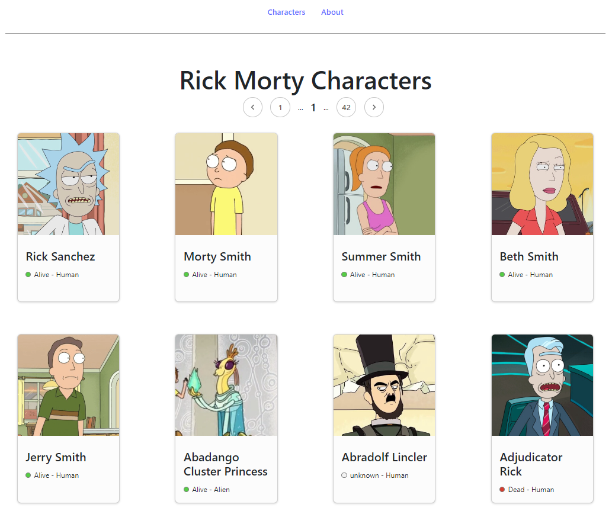
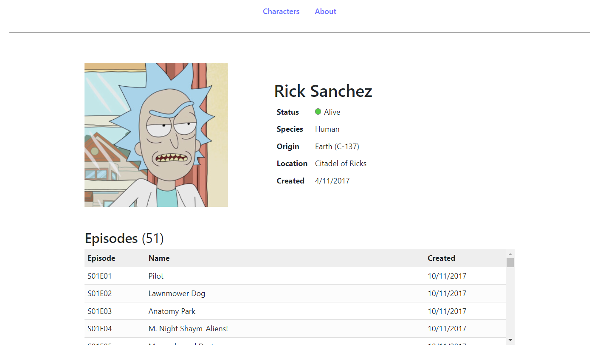
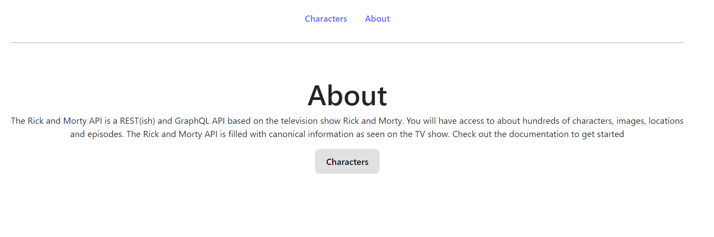

# React-Redux-Rick-Morty-API

## Tabla de Contenidos

- [Descripción](#descripcion)
- [¿Cómo Usar La Aplicación?](#uso)
- [Capturas de Pantalla](#capturas)

## Descripción <a name = "descripcion"></a>

Primera toma de contacto con React, la web muestra todos los personajes que salen en la serie de Rick & Morty. En la pagina principal nos saldrá un header, un sistema de navegación para mostrar los diferentes personajes y una carta con información básica de cada personaje, al hacer clic, saldrá otra vista con toda la información de ese personaje en concreto.

## ¿Cómo Usar La Aplicación? <a name = "uso"></a>

Para usar la aplicación hay que seguir las siguientes instrucciones:

Paso 1: Abrir la terminar y ejecutar lo siguiente:
```
npm i
```
Paso 2: En la misma terminal ejecutar el siguiente código:
```
npm run dev
```
Paso 3: En la terminar después de ejecutar el comando de arriba hacemos clic en el enlace que nos saldrá por terminal.

## Capturas de Pantalla <a name = "capturas"></a>

Imagen principal de la aplicación:



Imagen información del personaje ampliada:



Imagen About Us

